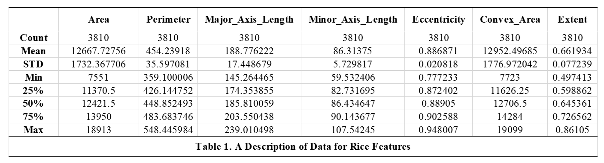
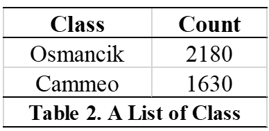
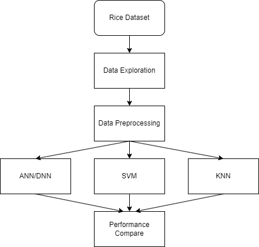
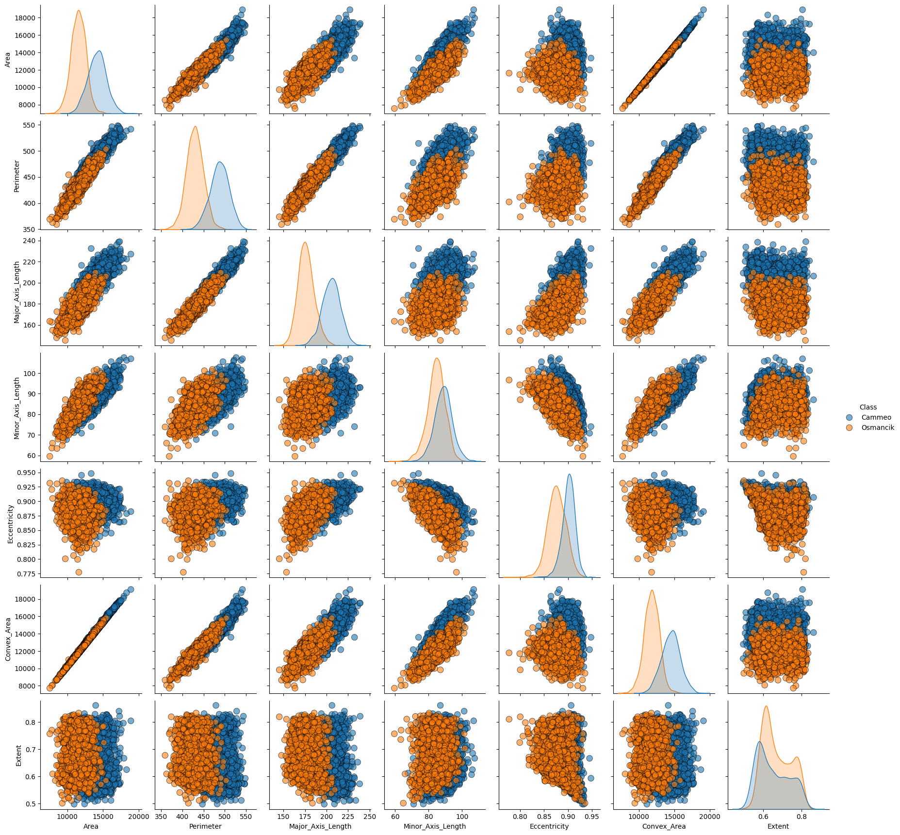
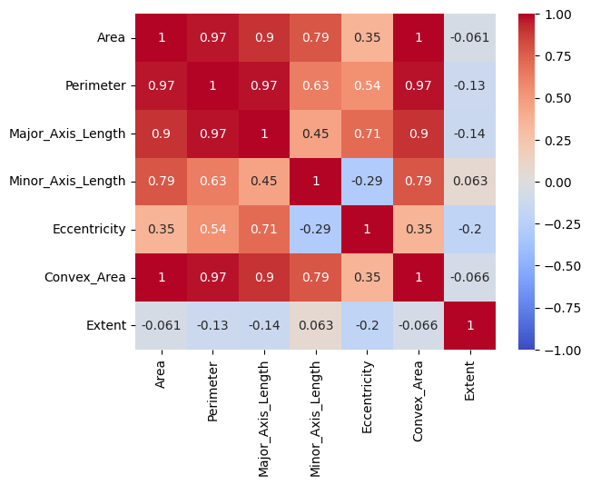

# Final Report

## Table of Contents
- [Final Report](#final-report)
  - [Table of Contents](#table-of-contents)
  - [Model 3](#model-3)
  - [A complete submission of all prior submissions with code included](#a-complete-submission-of-all-prior-submissions-with-code-included)
  - [Introduction](#introduction)
  - [Figures](#figures)
  - [Methods Section](#methods-section)
    - [Data Exploration](#data-exploration)
    - [Preprocessing Steps](#preprocessing-steps)
    - [Models and Parameters](#models-and-parameters)
      - [Model 1 (ANN/DNN)](#model-1-anndnn)
      - [Model 2 (SVM)](#model-2-svm)
      - [Model 3 (KNN)](#model-3-knn)
  - [Results Section](#results-section)
    - [Model 1](#model-1)
    - [Model 2](#model-2)
    - [Model 3](#model-3-1)
  - [Discussion Section](#discussion-section)
  - [Conclusion Section](#conclusion-section)
  - [Collaboration Section](#collaboration-section)

## Model 3
<a target="_blank" href="https://colab.research.google.com/drive/1OD1qrBjE4OYI9Ho7hAMK1EPTR6X4C9xb#scrollTo=WPVICMsurQnU">
  
</a>

## A complete submission of all prior submissions with code included
[Milestone 1: Abstract, Data and Group Members (Done)](<../Milestone 1>)

[Milestone 2: Data Exploration & Initial Preprocessing (Done)](<../Milestone 2>)

[Milestone 3: Data Preprocessing Milestone 3 (Done)](<../Milestone 3>)

[Milestone 4: Model 2 and evaluation Milestone 4 (Done)](<../Milestone 4>)


## Introduction
In our project, we aim to develop a predictive model for classifying rice varieties (Cammeo and Osmancik) using data extracted from rice paddy images. We chose this project because it is an interesting topic in the field of agricultural technology. Classification of rice varieties among them may be beneficial for quality control and marketing. The potential of this predictive model can improve the rice industry. It could become a useful tool for farmers as well as agricultural markets.

## Figures
 \
 \
\
**Working Flow** \


## Methods Section
### Data Exploration
**Print feature info**
```python
X.info()
```
><class 'pandas.core.frame.DataFrame'>
>RangeIndex: 3810 entries, 0 to 3809
>Data columns (total 7 columns):
> |    |Column             |Non-Null Count | Dtype |
> |--- | ------|             -------------- | ----- | 
> |0|   Area               |3810 non-null   |int64  |
> |1|   Perimeter          |3810 non-null   |float64|
> |2|   Major_Axis_Length  |3810 non-null   |float64|
> |3|   Minor_Axis_Length  |3810 non-null   |float64|
> |4|   Eccentricity       |3810 non-null   |float64|
> |5|   Convex_Area        |3810 non-null   |int64  |
> |6|   Extent             |3810 non-null   |float64|
> 
>dtypes: float64(5), int64(2)
>memory usage: 208.5 KB

**Print class info**
```python
y.info()
```
><class 'pandas.core.frame.DataFrame'>
>RangeIndex: 3810 entries, 0 to 3809
>Data columns (total 1 columns):
> |    |Column  |Non-Null Count  |Dtype| 
> |--- | ------ | --------------  |----- |
> |0 |  Class   |3810 non-null   |object|
>
>dtypes: object(1)
>memory usage: 29.9+ KB

There are no null values for all feature data. \
A detailed analysis of the values is shown in table 1 and table 2. 

**Pairplot** \
 \
**Heatmap** \


### Preprocessing Steps
We used MinMax Normalization to normalize our data. We also used One-Hot Encoding to encode our target classes to numerical values.
```python
scaler = MinMaxScaler()
X_normalized = scaler.fit_transform(X)

one_hot = OneHotEncoder()
y_one_hot = one_hot.fit_transform(y.values.reshape(-1,1)).toarray()
```

### Models and Parameters
#### Model 1 (ANN/DNN)
```python
model = Sequential()
model.add(Dense(units = 64, activation = 'relu', input_shape=(X_train.shape[1],)))
model.add(Dense(units = 16, activation = 'relu'))
model.add(Dense(units = 1, activation = 'sigmoid'))
model.compile(optimizer = 'rmsprop', loss = 'binary_crossentropy',
              metrics=[
                  tf.keras.metrics.Precision(name='precision'),
                  tf.keras.metrics.Recall(name='recall'),
                  'accuracy'
                  ])
history = model.fit(X_train.astype('float'), y_train, batch_size = 1, epochs = 10, validation_split=0.2, verbose = 0)
```
<a target="_blank" href="https://colab.research.google.com/drive/1kSHfct3UeFsFB2DUTZJE6G6X70RQnjvS">
  
</a>

#### Model 2 (SVM)
Version 1:
```python
svm_model = SVC(kernel='rbf')
svm_model.fit(X_train, y_train)
```
Version 2:
```python
svm_model = SVC(kernel='linear')
svm_model.fit(X_train, y_train)
```
<a target="_blank" href="https://colab.research.google.com/drive/1opJFstOA3cIdmKUkVC-ap4urjRuDM9NS?usp=sharing">
  
</a>

#### Model 3 (KNN)
```python
knn = KNeighborsClassifier()
knn.fit(X_train, y_train)
```
<a target="_blank" href="https://colab.research.google.com/drive/1OD1qrBjE4OYI9Ho7hAMK1EPTR6X4C9xb#scrollTo=WPVICMsurQnU">
  
</a>

## Results Section
### Model 1
```
              precision    recall  f1-score   support

           0       0.89      0.95      0.92       350
           1       0.95      0.90      0.93       412

    accuracy                           0.92       762
   macro avg       0.92      0.93      0.92       762
weighted avg       0.93      0.92      0.92       762
```
### Model 2
Version 1:
```
Accuracy: 0.9291338582677166
Classification Report:
              precision    recall  f1-score   support

          0       0.93      0.92      0.92       350
          1       0.93      0.94      0.93       412

    accuracy                           0.93       762
  macro avg       0.93      0.93      0.93       762
weighted avg       0.93      0.93      0.93       762

Loss:
2.5542746496224753
Test Error:
0.07086614173228345
```

Version 2:
```
Accuracy: 0.9304461942257218
Classification Report:
              precision    recall  f1-score   support

          0       0.92      0.93      0.92       350
          1       0.94      0.93      0.94       412

    accuracy                           0.93       762
  macro avg       0.93      0.93      0.93       762
weighted avg       0.93      0.93      0.93       762

Loss:
2.5069732672220595
Test Error:
0.06955380577427817
```

### Model 3
```
Accuracy: 0.926509186351706
Classification Report:
                precision    recall  f1-score   support

            0       0.93      0.90      0.92       337
            1       0.92      0.95      0.94       425

    accuracy                           0.93       762
    macro avg       0.93      0.92      0.93       762
weighted avg       0.93      0.93      0.93       762

Loss:
  2.648877414423308
Test Error:
  0.07349081364829402
```

## Discussion Section
Initially, we intended to use Naive Bayes. However, upon evaluation, we found that the metrics for this model were unsatisfactory. This led us to reconsider our choice and ultimately switch to the K-Nearest Neighbors (KNN) algorithm, which showed significantly better performance. 

Our data and labels remained consistent with those used in Milestone 4. Given that the results in Milestone 4 were satisfactory, we saw no need for modifications in this aspect.

While our models showed promising results, there are several shortcomings to acknowledge. Firstly, the simplicity of Naive Bayes may have contributed to its initial poor performance, indicating a need for more complex models in this context. Additionally, the reliance on log loss as our sole evaluation metric may not capture all aspects of model performance, suggesting the potential benefit of incorporating additional metrics in future analyses. The data set is not very large, although it makes it convenient for us to do preliminary research. But if we want to do further analysis, we may need more data.

## Conclusion Section
The model currently perform well, with above 93% accuracy on testing data. The model's test accuracy is a bit better than the previous one, which show that KNN can perform better in this classification task.

Throughout the project, we encountered several challenges, such as selecting appropriate features, dealing with imbalanced data, and choosing the right evaluation metrics. We addressed these challenges through feature engineering, data preprocessing techniques, and experimenting with different models.

Additional feature engineering techniques, such as creating interaction terms or applying more sophisticated transformations, might have enhanced the predictive power of our models. Given the imbalanced nature of our dataset, exploring alternative metrics like precision-recall curves or the F1 score could have provided a more nuanced understanding of our model's performance.

In future work, we would like to explore these areas further and investigate the potential of advanced techniques like deep learning or unsupervised learning methods to improve our predictions.

## Collaboration Section
- Chi Zhang (Team Lead): Organize meetings, coding, write-up, and repo management, project website
- Chengtao Wu (Member): Preprocess the data, build the models. 
- Hongyuan Jia (Member): Write the write-up, data plotting
- Yilin Song (Member): Helped in bug fixing, data preprocessing, and model building
- Meihui Liu (Member): Data exploring and plotting, Final report writing and organization
- Aaron Li (Member): Helped writting the write-up and plotting data
- Name (Role): Jobs


